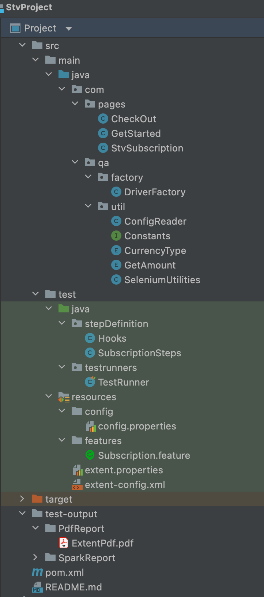
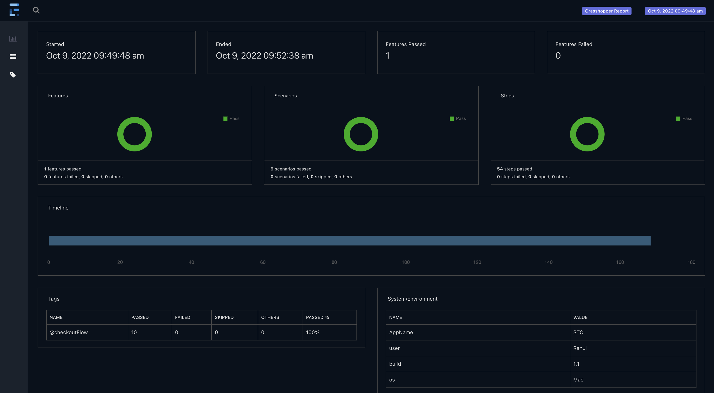
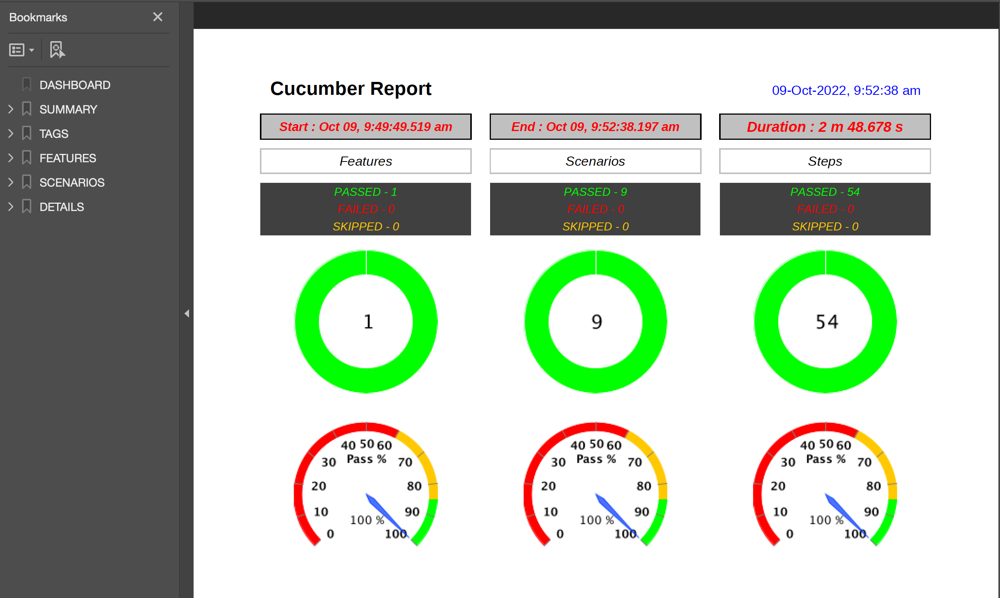

# STCTV Project
## Framework Structure:
##### Tools & libraries
1. Design Approach:- BDD Framework
2. Custom Page Object Pattern and utility functions
3. JAVA: - Programming language
4. TestNg: - TestNg Java testing framework
5. Maven: - Build tool
6. Git: - Version Control
7. Reporting- Extent Reports, PDF Reports

The framework incorporates design principle of BDD (Behaviour driven development) which promotes writing acceptance tests by describing behaviour of application under test in simple english language from the perspective of its stakeholders. Having test written in Natural language helps the Project Team (Product Owners, Business Analysts, Development and QA team) to understand and track the requirements

This project uses Page Object Model approach where separate class is mapped to each web page. i.e. All the webElements present on the checkout webpage will be declared in Checkout.java class, and methods for performing actions. Page Object model avoids duplication and improves code maintainability and readability.

##### Pages:
PageObjects are used to store the WebElements for a Web Page and maintains separate class for every single WebPage. All the WebElements and Actions corresponding to webPage are declared here. WebElements are initialized using PageFactory.initElements(DriverFactory.getDriver(), this) method.

```java
import org.openqa.selenium.WebDriver;

public class StvSubscription implements Constants {
    public static String country;
    private WebDriver driver;
    @FindBy(id = "changeLanguageButton")
    public WebElement changeLanguageButton;

    public StvSubscription(WebDriver driver) {
        this.driver=driver;
        PageFactory.initElements(driver, this);
    }

    public void selectCountry(String country) {
        if (country.equalsIgnoreCase(Constants.KSA))
            utilities.click(KSA);
    }
}
```

##### Factory:
This package includes DriverFactory class which initializes driver with required capabilities. 

##### util
This is utility package contains Helper classes which are mainly used for handling common challenges. ConfigReader class is used to load the properties from config.properties file. CurrencyType and GetAmount are enum and used for getting constants value
The URL, Browser Configuration etc. are defined in the respective config.properties file. 

##### StepDefinition:
All steps defined in Feature file needs to be implemented in Step Definitions Class
```java
public class SubscriptionSteps {
    StvSubscription stvSubscription = new StvSubscription(DriverFactory.getDriver());
    @Given("user has logged in to application")
    public void user_has_logged_in_to_application() {
        DriverFactory.getDriver().get(configReader.init_prop().getProperty("url"));
    }

    @When("user selects country {string}")
    public void user_selects_country(String country) {
        stvSubscription.selectCountry(country);
    }
}
```

##### Feature Files
These files contain the acceptance criteria which are written in Gherkin Language and contains various scenarios.
```gherkin
@checkoutFlow
  Scenario Outline: verify user can checkout the subscribed package
    When user selects country "<country>"
    And choose and verify trial plan type "<plan>"
    And user enters account credentials
    And user includes the add ons "<discovery+>" "<sports>"
    Then verify checkout details are correct
    Examples:
      | country | plan    | discovery+ | sports |
      | Kuwait  | Lite    | true       | true   |
```

##### Run Test Suite
Test Suites are used to run a group of Tests which are tagged and represented in form of Feature files & Scenarios
Right Click on TestRunner file and click Run 'TestRunner'
##### Project Structure


##### Spark Report


##### PDF Report


